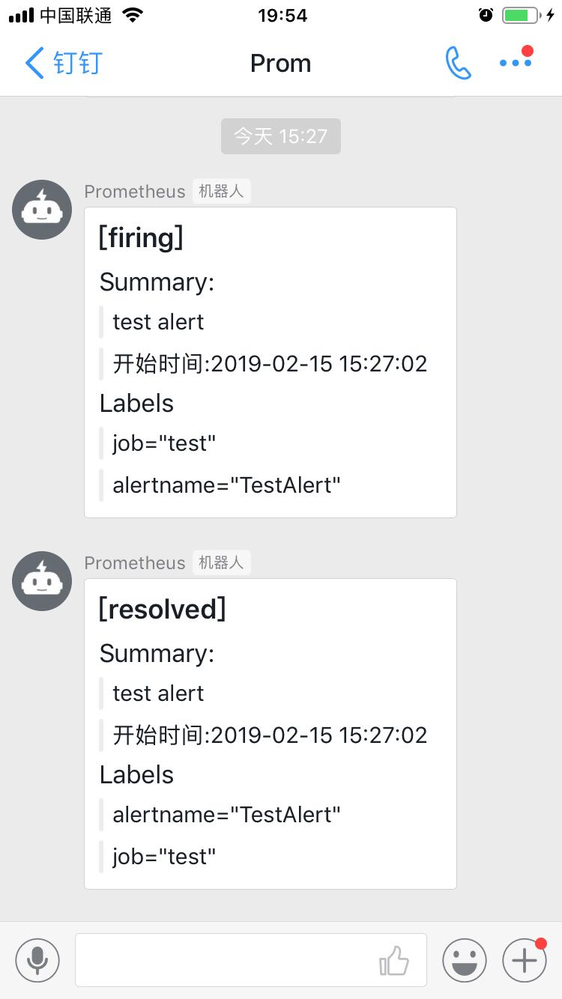

## Prometheus DingTalk Webhook

DDwebhook 主要功能是接收 Prometheus Alertmanager 发给DDWebhook的报警信息，转换为钉钉机器人可以识别的消息格式，再由钉钉机器人发送到钉钉群里。


### 1. 运行 DDwebhook

钉钉机器人webhook 相关信息请看本文档第6部分。

DDwebhook 启动后监听8080端口。

执行下面命令编译 DDwebhook。
```
git clone https://github.com/zhiwu88/DDwebhook.git
cd DDwebhook/src/cmd/ddwebhook
go build ddwebhook.go
./ddwebhook -defaultRobot=钉钉机器人webhook地址 &
```

> *注意事项*
> * 编译前注意添加GOPATH环境变量，例如 `export GOPATH=/data1/goWork:/data1/DDwebhook`
> * 如果在编译或使用过程中出现Gin框架相关的报错，重新下载Gin框架再重编译 `go get -u github.com/gin-gonic/gin`。


### 2. 配置 Prometheus Alertmanager 使用 DDwebhook 发送报警

添加接收器`DDWebhook`，再添加一个报警路由，匹配到`job: 'test'`这个标签就转发给`DDWebhook`接收器。默认也是转发给`DDWebhook`。

alertmanager.yml  已省略部分配置。
```
... ...

route:
  group_by: ['alertname']
  group_wait: 10s
  group_interval: 10s
  repeat_interval: 1h
  receiver: 'DDWebhook'
  routes:

  - match_re:
      job: 'test'
    group_wait: 10s
    receiver: 'DDWebhook'

receivers:
- name: 'DDWebhook'
  webhook_configs:
  - send_resolved: true
    url: http://localhost:8080/webhook

... ...
```


### 3. 测试告警发送

手工编写一条告警测试信息，推送给 Alertmanager 的API接口。
```
# curl -H "Content-Type: application/json" -d '[{"labels":{"alertname":"TestAlert","job":"test"},"Annotations":{"description":"test alert"}}]' localhost:9093/api/v1/alerts

{"status":"success"}
```

收到成功的响应后，登录 Alertmanager webUI 可以看到这条信息。

过几秒钟等待后钉钉群即可收到告警信息，并且几分钟后（resolve_timeout决定），Alertmanager没有继续收到报警或恢复信息，会自动发一个恢复信息。


 


### 4. DDwebhook 日志

从标准输出或者 /var/log/messages 里能看到 DDwebhook 日志，以下为本次测试的全部日志。

```
[root@localhost ddwebhook]# ./ddwebhook -defaultRobot=https://oapi.dingtalk.com/robot/send?access_token=3b9298a894e2477459bfc753b612741d3a0c9fd8920054b274931aa572f316c1 &
[1] 6887

[GIN-debug] [WARNING] Creating an Engine instance with the Logger and Recovery middleware already attached.
[GIN-debug] [WARNING] Running in "debug" mode. Switch to "release" mode in production.
 - using env:	export GIN_MODE=release
 - using code:	gin.SetMode(gin.ReleaseMode)

[GIN-debug] POST   /webhook                  --> main.main.func1 (3 handlers)
[GIN-debug] Environment variable PORT is undefined. Using port :8080 by default[GIN-debug] Listening and serving HTTP on :8080


{Version:4 GroupKey:{}/{job=~"^(?:test)$"}:{alertname="TestAlert"} Status:firing Receiver:sendToWebhook GroupLabels:map[alertname:TestAlert] CommonLabels:map[alertname:TestAlert job:test] CommonAnnotations:map[description:test alert] ExternalURL:http://localhost.localdomain:9093 Alerts:[{Labels:map[alertname:TestAlert job:test] Annotations:map[description:test alert] StartsAt:2019-02-15 15:27:02.211813263 +0800 CST EndsAt:0001-01-01 00:00:00 +0000 UTC}]}
&{MsgType:markdown At:0xc0001c4420 Markdown:0xc0001c4400}
{"msgtype":"markdown","At":{"atMobiles":null,"isAtAll":false},"markdown":{"title":"[firing] ","text":"### [firing] \n#### Summary:  \n\n\u003e test alert \n\n\u003e 开始时间:2019-02-15 15:27:02 \n\n #### Labels \n\n\u003e job=\"test\" \n\n\u003e alertname=\"TestAlert\" \n"}}
response Status: 200 OK
respose Headers: map[Server:[nginx] Date:[Fri, 15 Feb 2019 07:27:12 GMT] Content-Type:[application/json] Cache-Control:[no-cache]]
[GIN] 2019/02/15 - 15:27:12 | 200 |  444.279356ms |       127.0.0.1 | POST     /webhook
{Version:4 GroupKey:{}/{job=~"^(?:test)$"}:{alertname="TestAlert"} Status:resolved Receiver:sendToWebhook GroupLabels:map[alertname:TestAlert] CommonLabels:map[alertname:TestAlert job:test] CommonAnnotations:map[description:test alert] ExternalURL:http://localhost.localdomain:9093 Alerts:[{Labels:map[alertname:TestAlert job:test] Annotations:map[description:test alert] StartsAt:2019-02-15 15:27:02.211813263 +0800 CST EndsAt:2019-02-15 15:32:02.211813263 +0800 CST}]}
&{MsgType:markdown At:0xc00039c260 Markdown:0xc00039c240}
{"msgtype":"markdown","At":{"atMobiles":null,"isAtAll":false},"markdown":{"title":"[resolved] ","text":"### [resolved] \n#### Summary:  \n\n\u003e test alert \n\n\u003e 开始时间:2019-02-15 15:27:02 \n\n #### Labels \n\n\u003e alertname=\"TestAlert\" \n\n\u003e job=\"test\" \n"}}
response Status: 200 OK
respose Headers: map[Server:[nginx] Date:[Fri, 15 Feb 2019 07:32:02 GMT] Content-Type:[application/json] Cache-Control:[no-cache]]
[GIN] 2019/02/15 - 15:32:02 | 200 |  156.396221ms |       127.0.0.1 | POST     /webhook
```


### 5. Alertmanager 发给Webhook的报警信息格式

以下是 Prometheus Alertmanager 发给Webhook的报警信息格式。
```
{
  "version": "4",
  "groupKey": <string>,    // key identifying the group of alerts (e.g. to deduplicate)
  "status": "<resolved|firing>",
  "receiver": <string>,
  "groupLabels": <object>,
  "commonLabels": <object>,
  "commonAnnotations": <object>,
  "externalURL": <string>,  // backlink to the Alertmanager.
  "alerts": [
    {
      "status": "<resolved|firing>",
      "labels": <object>,
      "annotations": <object>,
      "startsAt": "<rfc3339>",
      "endsAt": "<rfc3339>",
      "generatorURL": <string> // identifies the entity that caused the alert
    },
    ...
  ]
}
```

理解参考官方文档：
- https://prometheus.io/docs/alerting/configuration/#webhook_config
- https://prometheus.io/docs/alerting/notifications/


线上 metric 触发报警时实际从 Alertmanager 发出的告警内容，会有 metric 的标签以及报警规则的 summary 和 description信息。
```
{
  Version:4 
  GroupKey:{}/{db=~"^(?:db[1-9])$"}:{alertname="RedisKey"} 
  Status:resolved 
  Receiver:sendToWebhook
  GroupLabels:map[alertname:RedisKey] 
  CommonLabels:map[product:邮箱 addr:redis://localhost:6379 alertname:RedisKey db:db1 instance:localhost:9121 job:redis_exporter] 
  CommonAnnotations:map[description:localhost:9121 current value is 6 summary:redis key greater than 5 on localhost:9121 ] 
  ExternalURL:http://localhost.localdomain:9093 
  Alerts:[
    {
	  Labels:map[addr:redis://localhost:6379 alertname:RedisKey db:db1 instance:localhost:9121 job:redis_exporter  product:邮箱]   
	  Annotations:map[description:localhost:9121 current value is 6 summary:redis key greater than 5 on localhost:9121 ] 
	  StartsAt:2018-11-21 17:58:14.297016465 +0800 CST 
	  EndsAt:2018-11-22 16:54:59.297016465 +0800 CST
	}
  ]
}
```


手工推送告警信息给 Alertmanager 测试。
```
curl -H "Content-Type: application/json" -d '[{"labels":{"alertname":"TestAlert"}}]' localhost:9093/api/v1/alerts
curl -H "Content-Type: application/json" -d '[{"labels":{"alertname":"TestAlert","job":"test"},"Annotations":{"description":"test alert"}}]' localhost:9093/api/v1/alerts
curl -H "Content-Type: application/json" -d '[{"labels":{"product":"邮箱","job":"服务名","instance":"服务下某部分"},"Annotations":{"description":"test description","summary":"test summary"}}]' localhost:9093/api/v1/alerts
curl -H "Content-Type: application/json" -d '[{"labels":{"product":"邮箱","job":"服务名","instance":"服务下某部分","severity":"High"},"Annotations":{"description":"test description","summary":"test summary"}}]' localhost:9093/api/v1/alerts
```


### 6. 钉钉机器人 webhook 需要接收的报警消息格式

钉钉机器人 webhook 地址获取方式参考下面的官方文档。

钉钉机器人 webhook 接收消息类型有多种类型，这里选用 markdown 类型，消息格式如下。
```
{
    "msgtype": "markdown",
    "markdown": {
        "title":"Prometheus告警信息",
        "text": "#### 监控指标\n
        > 监控描述信息\n\n
        > ###### 告警时间 \n"
    },
    "at": {
	    "isAtAll": false
    }
}
```

钉钉自定义机器人官方文档
- https://open-doc.dingtalk.com/docs/doc.htm?treeId=257&articleId=105735&docType=1


可以直接测试钉钉机器人webhook是否正常使用。
```
curl -l -H "Content-type: application/json" -X POST -d '{"msgtype": "markdown","markdown": {"title":"Prometheus告警信息","text": "#### 监控指标\n> 监控描述信息\n\n> ###### 告警时间 \n"},"at": {"isAtAll": false}}'  https://oapi.dingtalk.com/robot/send?access_token=3b9298a894e2477459bfc753b612741d3a0c9fd8920054b274931aa572f316c1

{"errmsg":"ok","errcode":0}
```


参考：
----
- http://ylzheng.com/2018/03/01/alertmanager-webhook-dingtalk/
- https://open-doc.dingtalk.com/docs/doc.htm?treeId=257&articleId=105735&docType=1

